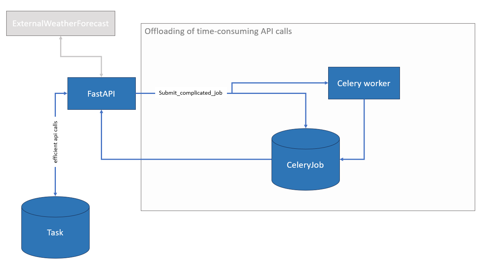

# Weather Forecast Service
This project delivers a FastAPI application for forecasting offshore weather, running schedule analyses, and delegating long-running computations to a Celery worker backed by Redis. PostgreSQL stores task metadata and job results, while a JSON payload provides a lightweight weather feed for demonstration purposes.

## Documentation
Interactive OpenAPI documentation is available once the API is running at **http://localhost:8020/docs**.

## App design

The app is designed in the FastAPI framework utilizing PostgreSQL as database. A celery framework is also in place to handle longer duration tasks.


### FastAPI
The app is designed using FastAPI. FastAPI is selected as it's a more modern API framework. 

### PostgreSQL
Selected on the following criteria
- Price(open source)
- JSON support
- Familiar with relational databases


### Docker
Docker is used to bundle the app. It is portable and easy to spin up across computers/clients


## Getting started

### Launch docker setup
This assumes docker is installed on host
```bash
docker compose up --build
```

Credentials default to `postgres/postgres` with database `appdb` (see `docker-compose.yml`).

### Seed the demo schema
This is automatically done in the app, but schould be removed in a production app
```bash
python -m app.init_mock_schedule_db
```

### Patch mock dat-set for weather forecast
Script that enlarges the mock data-set provided, such that we can use today+12h without running out of data.
```bash
python -m demo_tools.generate_weather_forecast_mock
```

### Run the FastAPI app
The app is launched by running docker-compose.yml, it can be run otherwise by. Keep port at 8020 for "external weather service" to work
```bash
uvicorn app.main:app --reload --port 8020
```

### Try the demo
* Visit **http://localhost:8020/docs** for interactive API docs.
* Trigger sample requests with `python -m demo_tools.put_and_post`.


## Testing
The docker containers can be launched with GitHub actions to perform tests in the api calls.